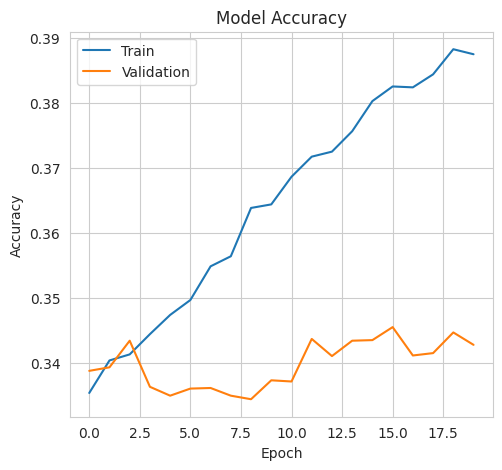
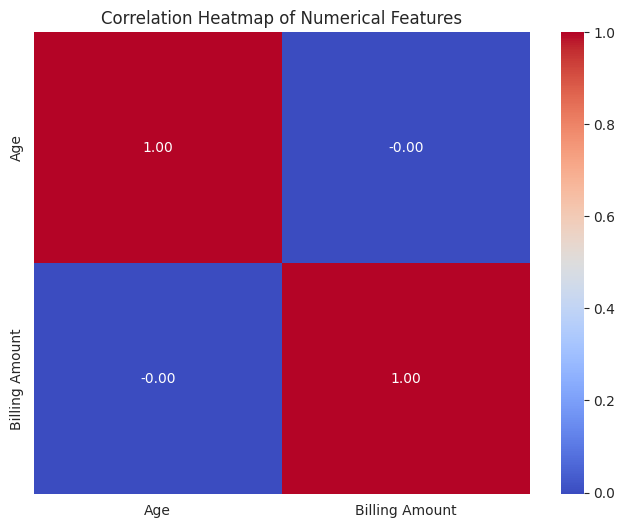
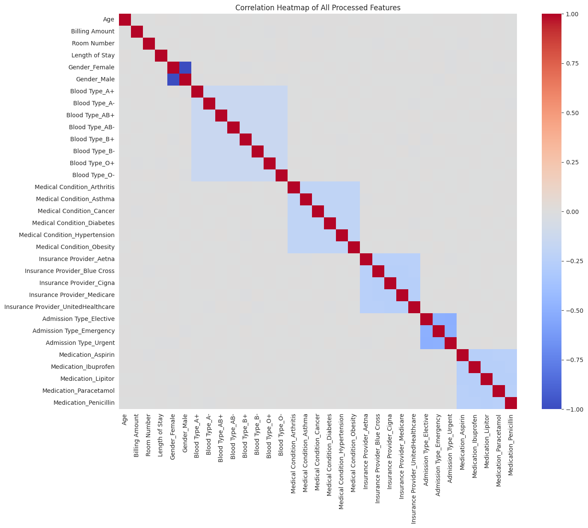

# 🏥 Medical Test Results Prediction using Deep Learning
[](https://www.python.org/downloads/)
[](https://www.tensorflow.org/)
[](https://opensource.org/licenses/MIT)

 

**Welcome to the Medical Test Results Prediction project. This repository is the capstone project for the "Deep Learning with Keras Python" course from BISA AI Academy. The primary objective is to build a Deep Neural Network (DNN) model capable of predicting a patient's medical test results (`Normal`, `Abnormal`, or `Inconclusive`) based on their demographic and clinical data.**

---

## 📋 Table of Contents

*   [Project Background](#-project-background)
*   [Dataset](#-dataset)
*   [Repository Structure](#-repository-structure)
*   [Methodology](#-methodology)
*   [Installation](#️-installation)
*   [How to Run](#-how-to-run)
*   [Results (Placeholder)](#-results)
*   [License](#-license)

---

## 🚀 Project Background

In the digital age, healthcare data has become an invaluable asset. The ability to analyze and extract insights from medical records can significantly aid healthcare institutions in decision-making. This project serves as a case study for implementing Deep Learning to classify medical test outcomes. By predicting test results, this project aims to demonstrate the potential of AI in supporting clinical diagnostics.

---

## 📊 Dataset

The project utilizes the **Healthcare Dataset (Synthetic)**, sourced from Kaggle.

*   **Source:** [Kaggle Healthcare Dataset](https://www.kaggle.com/datasets/prasad22/healthcare-dataset/data)
*   **Description:** This dataset contains 15 columns, including patient information such as age, gender, medical conditions, hospital admission details, and the target column `Test Results`.
*   **Total Records:** 55,500
*   **Key Features:** Age, Gender, Blood Type, Medical Condition, Admission Type, etc.
*   **Target Variable:** `Test Results` (A multi-class classification problem with three categories: `Normal`, `Abnormal`, `Inconclusive`)

---

## 📂 Repository Structure

The project repository is organized as follows:

```
.
├── data/               # Stores the datasets (raw & processed)
├── models/             # Stores the trained model artifacts
├── notebooks/          # Contains Jupyter Notebooks for EDA and prototyping
├── reports/            # Contains generated figures and visualizations
├── src/                # Contains modular Python source code (.py scripts)
├── .gitignore          # Specifies files for Git to ignore
├── LICENSE             # Project license file
├── README.md           # You are here
└── requirements.txt    # Lists the required Python dependencies
```

---

## 🧠 Methodology

This project follows a systematic Data Science workflow:

1.  **Data Collection:** The dataset is downloaded from Kaggle.
2.  **Exploratory Data Analysis (EDA):** The data is analyzed and visualized to gain a deep understanding of patterns, distributions, and feature correlations.
3.  **Data Preprocessing:**
    *   Handling duplicate records.
    *   Dropping irrelevant columns (e.g., `Name`, `Doctor`).
    *   Performing feature engineering (e.g., calculating `Duration of Stay` from admission and discharge dates).
    *   Encoding categorical features (`One-Hot Encoding` or `Label Encoding`).
    *   Scaling numerical features using Normalization/Standardization.
4.  **Modeling:**
    *   Designing a Deep Neural Network (DNN) architecture using the Keras API.
    *   Utilizing the `categorical_crossentropy` loss function and the Adam optimizer.
5.  **Training & Evaluation:**
    *   Splitting the data into training and testing sets.
    *   Training the model while monitoring its performance.
    *   Evaluating the model using metrics such as Accuracy, Precision, Recall, F1-Score, and a Confusion Matrix.
6.  **Conclusion:** Drawing conclusions from the model's performance and identifying potential areas for future improvement.

---

## 🛠️ Installation

To set up the environment and run this project on your local machine, please follow these steps:

1.  **Clone the repository:**
    ```bash
    git clone https://github.com/your-username/healthcare-test-results-prediction.git
    cd healthcare-test-results-prediction
    ```

2.  **Create and activate a virtual environment (recommended):**
    ```bash
    python -m venv venv
    source venv/bin/activate  # For Windows use: venv\Scripts\activate
    ```

3.  **Install the required dependencies:**
    ```bash
    pip install -r requirements.txt
    ```

---

## 📈 How to Run

You can reproduce the results by running the Jupyter Notebooks sequentially, located in the `notebooks/` directory:

1.  `01_data_exploration.ipynb`: To view the exploratory data analysis.
2.  `02_data_preprocessing.ipynb`: To clean and prepare the data for modeling.
3.  `03_model_building_and_training.ipynb`: To build, train, and evaluate the Deep Learning model.

---

## 🏆 Results and Performance Analysis

After executing the complete project workflow—from exploratory data analysis and preprocessing to model training and evaluation—the constructed Deep Neural Network (DNN) model yielded interesting results that provide critical insights into the nature of the dataset used.

### **Model Performance**

The model was trained for 20 epochs and evaluated on the test set (20% of unseen data). The evaluation resulted in a final **accuracy of 34.05%**.



Here is a summary of the key performance metrics from the classification report:
-   **Precision:** 34% (macro avg)
-   **Recall:** 34% (macro avg)
-   **F1-Score:** 33% (macro avg)

The Confusion Matrix below visually confirms the model's difficulty in distinguishing between the three target classes (`Abnormal`, `Inconclusive`, `Normal`). The predictions are distributed relatively evenly among the incorrect classes.




### **Conclusion and Further Investigation**

At first glance, an accuracy of ~34% might seem low. However, this result is incredibly informative when considered in context. A random guess for this 3-class problem would yield an accuracy of approximately 33.3%. The model's performance, being only slightly above this baseline, is a strong indicator that **it was unable to find significant predictive patterns within the feature data**.

**Why Was This the Case? The Nature of Synthetic Data**

A deeper investigation into the dataset's description and community discussions on its Kaggle page confirms that this is a **synthetic dataset**, likely generated by an algorithm without embedding strong causal relationships between the features and the target variable.

This finding is further corroborated by observing other public notebooks on Kaggle that use the same dataset. A vast majority of them also report **accuracy levels stagnating in the 34-35% range**, regardless of the model or techniques employed.

**Key Insights:**
1.  **"Garbage In, Garbage Out":** This project serves as a perfect case study for this fundamental principle. The quality of and patterns within the data are the primary determinants of a model's performance. Even the most advanced model will struggle if the underlying data lacks predictive signal.
2.  **Importance of Data Context:** This result emphasizes the critical need to understand a dataset's origin and generation process. Knowing it was synthetic helps to correctly interpret the outcome, not as an implementation failure.
3.  **Process Success:** From a process standpoint, this project successfully executed every stage of a professional machine learning workflow: data cleaning, feature engineering, a valid deep learning architecture, a correct training process, and transparent evaluation.

In conclusion, despite the low predictive accuracy, this project successfully fulfilled its objective by demonstrating mastery of Deep Learning techniques with Keras and, more importantly, the ability to analyze and draw insightful conclusions from the results obtained.
---

## 📜 License

This project is licensed under the MIT License. See the `LICENSE` file for more details.
